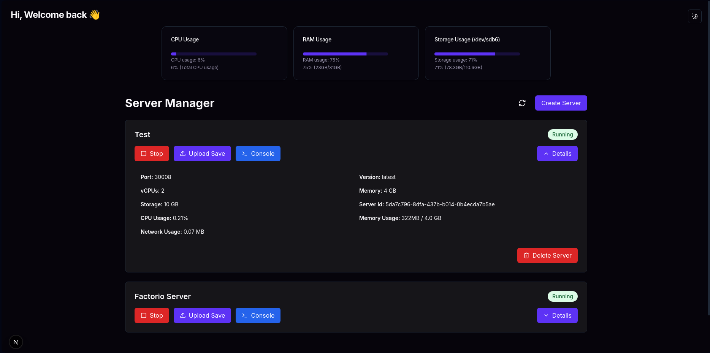
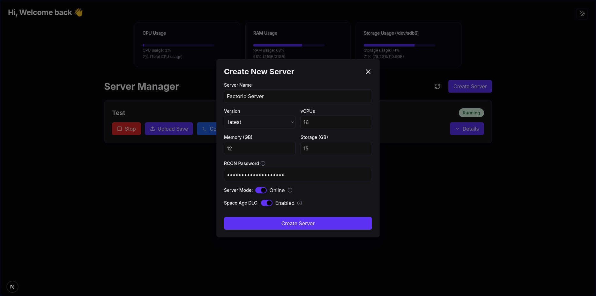

# Factorio Server Manager

This is a Factorio server manager built with **Next.js**, **Node.js**, and **Docker**. It allows you to host multiple Factorio servers simultaneously. I created this project for fun to improve my Docker skills and overall coding knowledge.

## Features

- **Create a Factorio server in a Docker container** with customizable settings:
  - Server name
  - Version
  - vCPUs
  - Memory
  - Storage
  - RCON password
  - Server mode (Online/Offline)
  - Space Age DLC (optional)
  - Upload save files
- **Factorio Console**:
  - Read logs
  - Execute commands
- **System Status on the frontend**:
  - CPU usage
  - RAM usage
  - Storage usage

## Upcoming Features

- Mod management
- Online player count display
- Frontend improvements
- Save backups and the ability to download saves
- Full Factorio server customization (server settings, game settings)
- Downloadable log history

## Installation

Before getting started, I highly recommend installing **PM2** for managing the backend:

```bash
npm install -g pm2
 ```
## Backend Setup

1. Clone the repository or download the project files.
2. Navigate to the backend directory:

   ```bash
   cd backend
   ```

3. Install dependencies:

   ```bash
   npm install
   ```

4. Start the backend using PM2:

   ```bash
   pm2 start app.js -i max
   ```

## Frontend Setup

1. Navigate to the frontend directory:

   ```bash
   cd frontend
   ```

2. Install frontend dependencies:

   ```bash
   npm install
   ```

3. Build and run the frontend:

   ```bash
   npm run build
   npm run dev
   ```

That’s it! You’re all set to create your first Factorio server.





## Credits

Special thanks to [Kiranism's Next.js Shadcn Dashboard Starter](https://github.com/Kiranism/next-shadcn-dashboard-starter) for faster project setup.

Feel free to contribute or open issues if you encounter any bugs.
